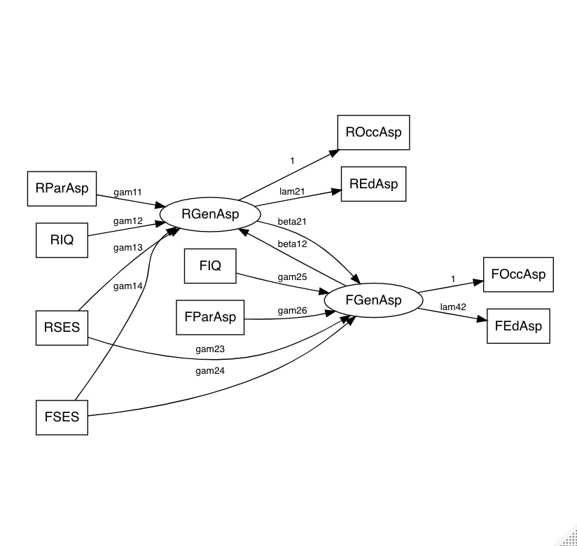
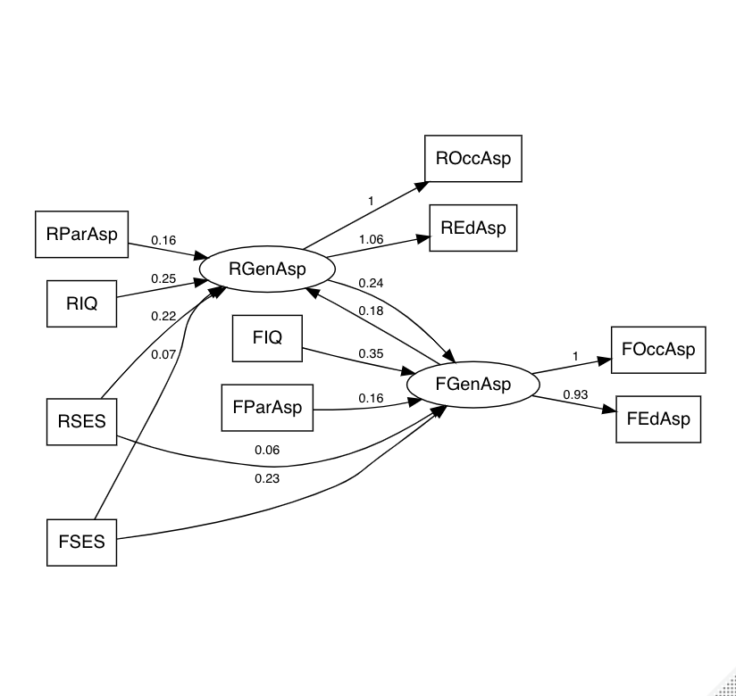

"Principal component analysis (PCA), Principal component regression (PCR), and Sparse PCA in R"

#   Some preparation and exploratory analysis

SO2: SO2 content of air in micrograms per cubic metre;
temp: average annual temperature in degrees Fahrenheit;
manu: number of manufacturing enterprises employing 20 or more workers;
popul: population size (1970 census) in thousands;
wind: average annual wind speed in miles per hour;
precip: average annual precipitation in inches;
predays: average number of days with precipitation per year.


```{r}
rm(list = ls())
#packages <- c("HAUSR2", "elasticnet")
#if (length(setdiff(packages, rownames(installed.packages()))) > 0) {
#  install.packages(setdiff(packages, rownames(installed.packages())), dependencies = TRUE)  
#}
library(HSAUR2)
head(USairpollution)
attach(USairpollution)
```


To begin we shall ignore the SO2 variable and concentrate on the others, two of which relate to human ecology (popul, manu) and four to climate (temp, Wind, precip, predays). A case can be made to use negative temperature values in subsequent analyses since then all six variables are such that high values represent a less attractive environment. This is, of course, a personal view, but as we shall see later, the simple transformation of temp does **aid interpretation**.

Quelle: *An Introduction to Applied Multivariate Analysis with R by Brian Everitt, Torsten Hothorn* p86

```{r}
USairpollution$negtemp <- temp*(-1)
USairpollution <- USairpollution[,c(1,8,3:7)]
attach(USairpollution)
head(USairpollution)

```

Check the sample correlation matrix and do the matrix scatterplot

```{r}

round(cor(USairpollution[,-1]),2) # sample correlation matrix
plot(USairpollution[,-1]) # matrix scatterplot
#Exclude SO2
```

#   Principal Component Analysis

QoL: Quality of Life

"first component might be regarded as some index of “quality of life”, with high values indicating a relatively poor environment (in the authors’ opinion at least).

The second component is largely concerned with a city’s rainfall having high coefficients for precip and predays and might be labelled as the
“wet weather” component. 

Component three is essentially a contrast between precip and negtemp and will separate cities having high temperatures and high rainfall from those that are colder but drier. A suitable label might be simply “climate type”."

```{r}
usair.pc<-princomp(USairpollution[,-1],cor=TRUE) 
summary(usair.pc,loadings=TRUE)

usair.pc$scores[,1:3]

par(pty="s")
plot(usair.pc$scores[,1],usair.pc$scores[,2],
     ylim=range(usair.pc$scores[,1]),
     xlab="QoL",ylab="Wet weather",type="n",lwd=2)
text(usair.pc$scores[,1],usair.pc$scores[,2],
     labels=abbreviate(row.names(USairpollution)),cex=0.7,lwd=2)

par(pty="s")
plot(usair.pc$scores[,1],usair.pc$scores[,3],
     ylim=range(usair.pc$scores[,1]),
     xlab="QoL",ylab="Climate type",type="n",lwd=2)
text(usair.pc$scores[,1],usair.pc$scores[,3],
     labels=abbreviate(row.names(USairpollution)),cex=0.7,lwd=2)

par(pty="s")
plot(usair.pc$scores[,2],usair.pc$scores[,3],
     ylim=range(usair.pc$scores[,2]),
     xlab="Wet weather",ylab="Climate type",type="n",lwd=2)
text(usair.pc$scores[,2],usair.pc$scores[,3],
     labels=abbreviate(row.names(USairpollution)),cex=0.7,lwd=2)

```

#   PCR

```{r}
par(mfrow=c(1,3))
plot(usair.pc$scores[,1],SO2,xlab="PC1")
plot(usair.pc$scores[,2],SO2,xlab="PC2")
plot(usair.pc$scores[,3],SO2,xlab="PC3")

usair.pcr <- lm(SO2~usair.pc$scores[,1]+usair.pc$scores[,2]+usair.pc$scores[,3])
summary(usair.pcr)

```

#   Big data in PCA

Another data set: "mnist_train.txt"

We only use the hand-writing number 3

```{r}
number <- read.table("mnist_train.txt", 
                   header = F, sep = ",")
dim(number)
number_3 <- number[which(number[,1]==3),]
dim(number_3)

number_mat <- matrix(as.numeric(number_3[3,-1]), 28, 28, byrow = T)
mat1 <- apply(number_mat, 2, rev)
image(1:28, 1:28, t(mat1), axes = FALSE, xlab = "", ylab = "", 
      col = grey(seq(1, 0, length = 255)))
```

Some data reduction：

```{r}
number_ <- number_3[,which(!apply(number_3,2,FUN = function(x){all(x == 0)}))]

number_$V1 <- NULL
dim(number_)
```

cor=FALSE indicates that we use covariance matrix here instead of correlation matrix, because the correlation matrix can only be used of there are no constant variables. But in such hand-writing data set, it's more likely to include a constant variable.

```{r}
out_pca <- princomp(number_, cor = FALSE)
```

Loadings of the first four PCs:

```{r}
loadings_pca <- cbind(round(out_pca$loadings[,1], digits = 4), 
                      round(out_pca$loadings[,2], digits = 4), 
                      round(out_pca$loadings[,3], digits = 4), 
                      round(out_pca$loadings[,4], digits = 4))

# proportion of explained variance
out_pca$sdev["Comp.1"]^2/sum(out_pca$sdev^2)
out_pca$sdev["Comp.2"]^2/sum(out_pca$sdev^2)
out_pca$sdev["Comp.3"]^2/sum(out_pca$sdev^2)
out_pca$sdev["Comp.4"]^2/sum(out_pca$sdev^2)
```

Extract the loadings of the factors only in the individual variables here

```{r}

used_pca <-which(names(number)%in%c(colnames(number_)))

pc <- matrix(0, nrow = 4, ncol = 784)
v <-1

for (i in used_pca) {
  pc[,i] <- loadings_pca[v,]
  v <- v+1
}

number_mat <- matrix(as.numeric(number_3[3,-1]), 28, 28, byrow = T) 
mat1 <- apply(number_mat, 2, rev)

col <- colorRampPalette(c("white", "blue"))
col2 <- colorRampPalette(c("white", "red"))

for (i in 1:4) {
  
  pca_mat <- matrix(as.numeric(pc[i,]), 28, 28, byrow = T) 
  mat_pca <- apply(pca_mat, 2, rev) 
  
  
  #blue: positive loadings, red: negative loadings)
  A <- t(mat1)
  B <- (A>1) * t(mat_pca)
  B[ B<=0.0 ] <- NA 
  
  image(1:28, 1:28, A, axes = FALSE, xlab = "", ylab = "", col = grey(seq(1, 0, length = 255)))
  image(1:28, 1:28, B, axes = FALSE, xlab = "", ylab = "", 
        col= col(10), add=T)  
  
  A <- t(mat1)
  B <- (A>1) * t(mat_pca)
  B[ B>=0.0 ] <- NA 
  
  image(1:28, 1:28, B, axes = FALSE, xlab = "", ylab = "", 
        col= col2(10), add=T) 
  
  B <- t(mat_pca)
  B[A>1] <-NA 
  B[ B>=0.00 ] <- NA 
  image(1:28, 1:28, B, axes = FALSE, xlab = "", ylab = "", 
        col= col(10), add=T)  # overlay
  
  B <- t(mat_pca)
  B[A>1] <-NA 
  B[ B<=0.00 ] <- NA 
  image(1:28, 1:28, B, axes = FALSE, xlab = "", ylab = "", 
        col= col2(10), add=T)  # overlay 
  
}

```

The first four principle components barely explains the whole information here

We can't see the clear structure of the negative or positive loadings of the the principle component on the individual variables, if we just look at 20% of explained variances. We would use some alternative techniques that would not be covered in this lecture

**Important point: We need to understand what the principle component analysis does. For what reason we could do it**


#   Factor Analysis

We consider the concept of manifest and latent variables

```{r}
#if(!require(c(MASS, klaR))){
#  install.packages(c("psych", "corrplot", "GPArotation"))
#  library(MASS)
#}

library(MASS)

# import data
bfi <- readRDS("bfi.rds")
head(bfi)

library(psych)
?bfi # info on original questionaire data

# corrplot
library(corrplot)
corr <- cor(na.omit(bfi))
corrplot(corr)

```

Some useful functions regarding to factor analysis

```{r}
### factanal() -  stats
#?factanal
# - Estimation only ML
# - Rotation:  Varimax (orthogonal) & Promax (oblique)

### fa() -  psych
#?fa
# - Estimation:  'minres' - Minimum Residual
#               'ml'     - ML
#               'pa'     - Principle Axes
#               sowie einige weitere Methoden
# - Rotation: huge variety

```


```{r}

library('GPArotation')
f <- fa(bfi, nfactors = 4, rotate = "oblimin", fm = "ml")
fa.organize(f)
fa.diagram(f)

### Interpretation:
# F1: N1/N2/N3: 'emotional fluctuation'
# F2: A2/A3/A5:  'Empathy'
# F3: C1/C2/C3:  'Perfektionism'
#                     -> C3 and C4 small loadings, not included here 
# F4: C5: 'wasting my time', not interpretable
#               
# -> Conclude: Subsetting of C-Items seeems not to be reasonable by content


### (i) Decision on number Factor
fa.parallel(bfi)

# -> Comnpare Versions with 2, 3 & 4 F
f2 <- fa(bfi, nfactors = 2, rotate = "oblimin", fm = "ml")
f3 <- fa(bfi, nfactors = 3, rotate = "oblimin", fm = "ml")
f4 <- fa(bfi, nfactors = 4, rotate = "oblimin", fm = "ml")
fa.diagram(f2)
fa.diagram(f3)
fa.diagram(f4)

# -> 3 F most resonable
```


```{r}
### (ii) Rotation techniques
# orthogonal
f_varimax <- fa(bfi, nfactors = 3, rotate = "varimax", fm = "ml")
f_quartimax <- fa(bfi, nfactors = 3, rotate = "quartimax", fm = "ml")
f_equamax <- fa(bfi, nfactors = 3, rotate = "equamax", fm = "ml")
# oblique
f_oblimin <- fa(bfi, nfactors = 3, rotate = "oblimin", fm = "ml")
f_promax <- fa(bfi, nfactors = 3, rotate = "promax", fm = "ml")

fa.diagram(f_varimax, main = "Varimax")
fa.diagram(f_quartimax, main = "Quartimax")
fa.diagram(f_equamax, main = "Equamax")
fa.diagram(f_oblimin, main = "Oblimin")
fa.diagram(f_promax, main = "Promax")

### Conclusion:
# 1) All orthogonal technique seem to yield identical results. 
#    Same for oblique. Both holds in general. If no general constraints, perform just one orth./obl FA 
#    and compare results
# 2) Both orthogonal and oblique yield nearly identical results .
#    Reason: nearly no correlation among F as depicted in plot for oblimin and promax. Both results 
#    would differ if F correlated
# -> Conclude: Here orth is fine.
# -> We keep using oblimin

```

信度最早由斯皮尔曼(Spearman)于1904年将其引入心理测量，指的是测验结果的一致性程度或可靠性程度。根据所关心的重点不同，信度可分为内在和外在信度两类。

内在信度指调查表中的一组问题是否测量的是同一个概念，也就是这些问题之间的内在一致性如何。最常用的内在信度指标为克朗巴哈系数和折半信度。最常用的外在信度指标是重测信度，即用同一问卷在不同时间对同一对象进行重复测量，然后计算一致程度

在实际研究中，很多事物/态度是不能直接被测量的，研究者们常设计一组题目间接反映它们的真实情况。但这些题目是否可以实现研究目的，就需要我们通过统计手段进一步分析了。如在本研究中，研究者设计了间接测量员工工作热情的6个题目，并希望判断它们的一致性。针对这种情况，我们可以使用Cronbach's α分析。

解释：Cronbach's α分析主要用于评价连续变量和有序分类变量的一致性，适用于本研究的研究数据。

Quelle: https://www.sohu.com/a/204514060_489312

```{r}
#?alpha

### A-Items
alpha(bfi[,c("A2","A3","A5")])
# -> acceptable  (alpha = 0,72)
### N-Items
alpha(bfi[,c("N1","N2","N3")])
# -> fine (alpha = 0,82)
### C-Items
#  Important: We observe neg q for C4 and C5  -> need to be modified in advance
bfi_new <- bfi
bfi_new$C4_rev <- 7 - bfi_new$C4
bfi_new$C5_rev <- 7 - bfi_new$C5
alpha(bfi_new[,c("C1","C2","C3","C4_rev","C5_rev")])
# ->  acceptable (alpha = 0,73)
 
```

#   Sructural Equation Modelling

```{r}
rm(list = ls())

library(sem)
library(semPlot)
library(corrplot)
library(DiagrammeR)

# Duncan, Haller, and Portes's nonrecursive peer-influences model 
 
R.DHP <- readMoments(diag=FALSE, names=c('ROccAsp', 'REdAsp', 'FOccAsp', 
                                         'FEdAsp', 'RParAsp', 'RIQ', 'RSES',
                                         'FSES', 'FIQ', 'FParAsp'), text = "
.6247                                                 
.3269  .3669                                                
.4216  .3275  .6404                               
.2137  .2742  .1124  .0839                          
.4105  .4043  .2903  .2598  .1839                     
.3240  .4047  .3054  .2786  .0489  .2220                
.2930  .2407  .4105  .3607  .0186  .1861  .2707           
.2995  .2863  .5191  .5007  .0782  .3355  .2302  .2950      
.0760  .0702  .2784  .1988  .1147  .1021  .0931 -.0438  .2087
") 
R.DHP
```

Show in plot

```{r}
corrplot(R.DHP)
```


```{r}
model.DHP.2 <- specifyEquations(covs="RGenAsp, FGenAsp", text = "
RGenAsp = gam11*RParAsp + gam12*RIQ + gam13*RSES + gam14*FSES + beta12*FGenAsp
FGenAsp = gam23*RSES + gam24*FSES + gam25*FIQ + gam26*FParAsp + beta21*RGenAsp
ROccAsp = 1*RGenAsp
REdAsp = lam21(1)*RGenAsp  
FOccAsp = 1*FGenAsp
FEdAsp = lam42(1)*FGenAsp                                
") 

```


```{r}
sem.DHP.2 <- sem(model.DHP.2, S=R.DHP, N=329,
                 fixed.x=c('RParAsp', 'RIQ', 'RSES', 'FSES', 'FIQ', 'FParAsp'))
summary(sem.DHP.2)

```


```{r}
pathDiagram(sem.DHP.2)
```




```{r}
pathDiagram(sem.DHP.2,edge.labels="values")
```


